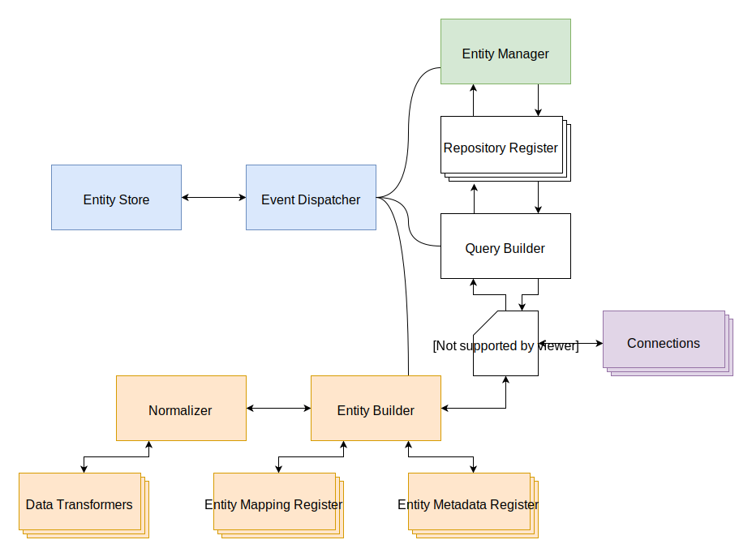

# Find

A find request to RESTORM at first may seem very complex but it can be grouped into simple principles and components. The diagram below describes the general workflow of a find request starting with the `EntityManager`. The rest of this document will describe what each step of the process is and why it's there.

1.  Get `EntityManager` and request the repository for a given entity from 
    `RepositoryRegister`
2.  Call a method on the repository which uses `QueryBuilder` to build a new    
    instance of `Query`. Query is given any appropriate `Connection` instance 
    to use for fetching data and also `EntityBuilder` for building the entity 
    from the data.
3.  `Query` fetches data from `Connection`.
4.  `Query` passes the data to `EntityBuilder` which creates a new instance 
    based on the information for that entity kept in `EntityMapping` which is 
    acquired from `EntityMappingRegister`. A new `EntityMetadata` is made for 
    the entity and stored in `EntityMetadataRegister`.
5.  `EntityBuilder` sends `EntityMetadata` and the entity data to `Normalizer` 
    to set the data onto the entity.
6.  `Normalizer` transforms the entity data using the data transformers.
7.  The newly created entity is returned up the chain back to the repository 
    which returns the entity.
