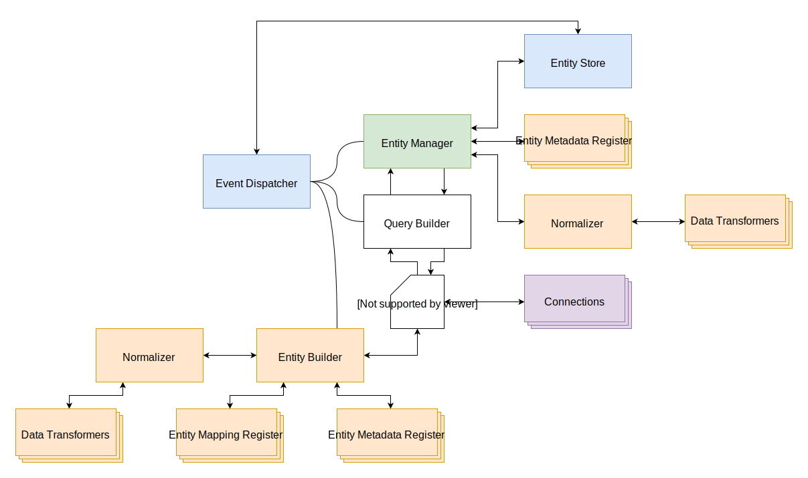

# Persist

Persisting an entity results in a write to the entity's connection. In the process on persisting the entity must be checked to see if it's known to RESTORM - you could be saving a brand new entity that wasn't fetched from a connection - and figure out what data has changed if any and send that data to the connection.

1.  Call `EntityManager::persist()` with a given entity instance.
2.  Dispatch the pre persist event which `EntityStore` subscribes to for 
    storing information about new entites.
3.  Get the last known state of the entity from `EntityStore`.
4.  Get the `EntityMetadata` for this entity which is used to get the current 
    data in the entity.
5.  Find the difference between the known state and current state of the 
    entity. Transform this data with `Normalizer` into normalized data that can 
    be sent to `Connection` later.
6.  User `QueryBuilder` to create a `Query` object. `E3ntityManager` will 
    decide whether to use a `POST` or `PATCH` request based on whether the 
    entity is new or known.
7.  `Query` fetches data from `Connection`.
8.  `Query` passes the data to `EntityBuilder` which updates the entity 
    instance based on the information for that entity kept in `EntityMapping` 
    which is acquired from `EntityMappingRegister`. A new `EntityMetadata` is 
    made for the entity and stored in `EntityMetadataRegister`.
9.  `EntityBuilder` sends `EntityMetadata` and the entity data to `Normalizer` 
    to set the data onto the entity.
10. `Normalizer` transforms the entity data using the data transformers.
11. The newly created entity is returned up the chain back to the repository 
    which returns the entity.
